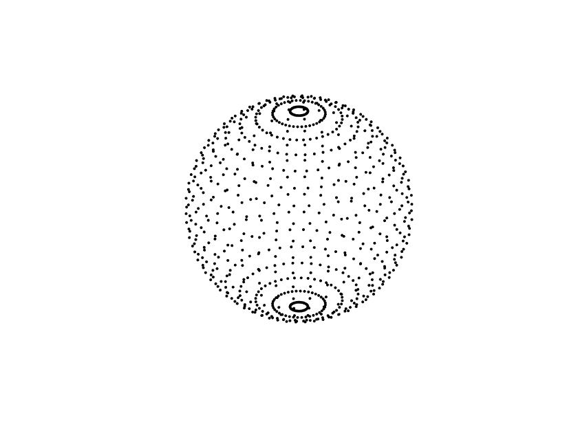
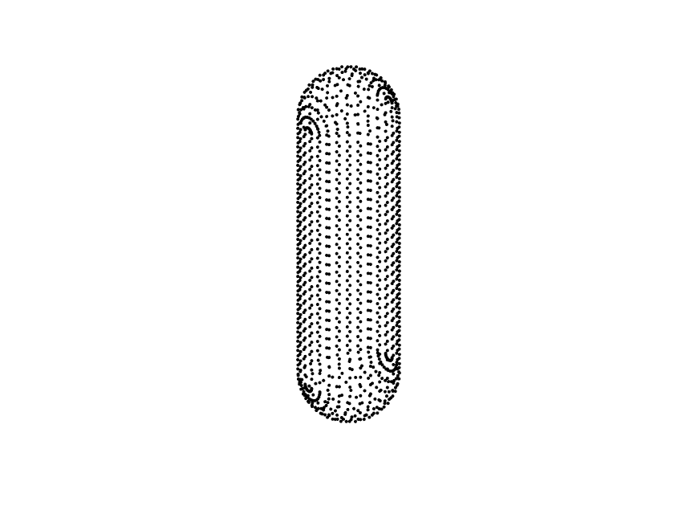
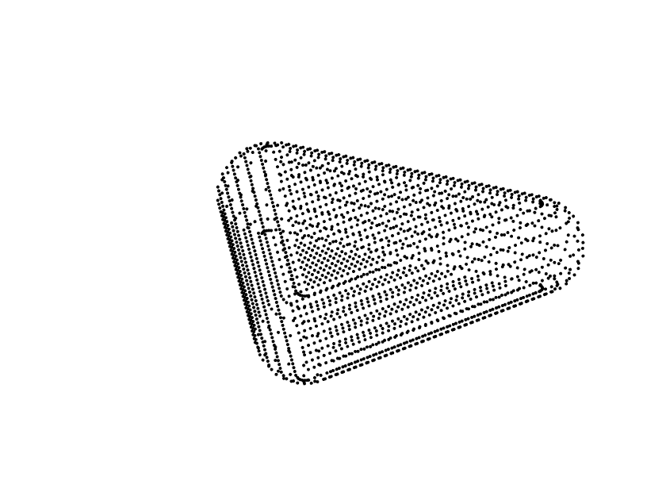
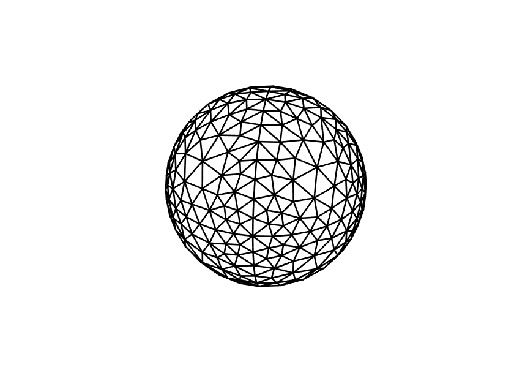
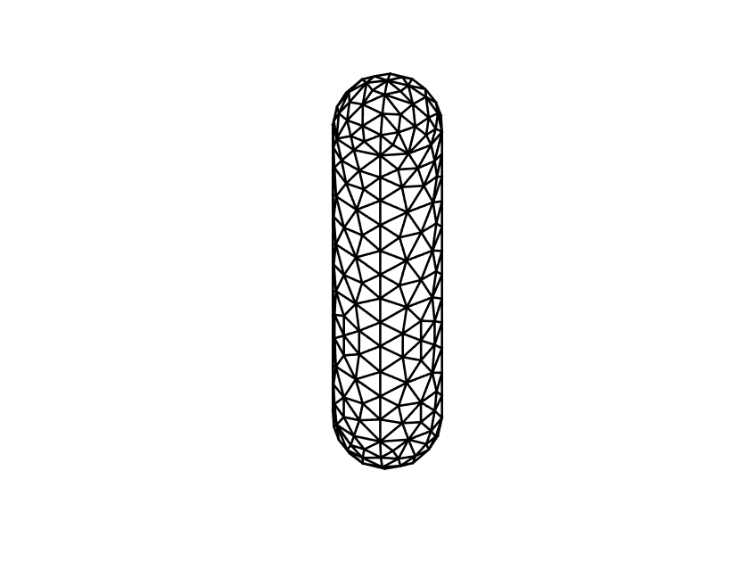
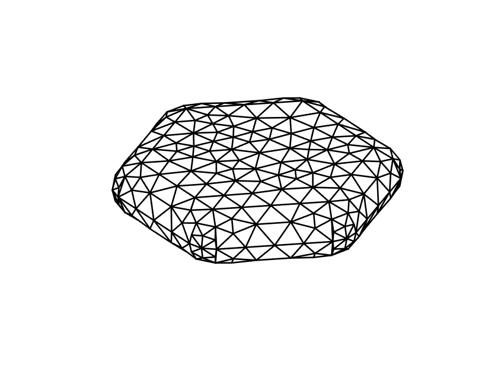

# Modelling of the optical properties of gold & silver nanoparticles with alternating morphologies using finite element method
The code is written in plain text, and is meant to be copy/pasted into the MATLAB editor. Only the '.m' files containing refractive indices have to be installed.
## Analytical model for spherical nanoparticles
  1. Ensure that files nrau.m, nrag.m, niau.m and niag.m are installed and visible in the MATLAB folder.
  2. Run the [absorption calculation code](https://github.com/Lasseb200/P3/blob/main/MATLAB%20Analytical%20model%20for%20spherical%20nanoparticles).
## Pulse expansion:
  1. Ensure that files nrau.m, nrag.m, niau.m and niag.m are installed and visible in the MATLAB folder.
  2. Run the 3D point model for either [spheres](https://github.com/Lasseb200/P3/blob/main/MATLAB-finite-element-method/Pulse%20expansion/Pulse%20sphere), [rods](https://github.com/Lasseb200/P3/blob/main/MATLAB-finite-element-method/Pulse%20expansion/Pulse%20rod) or [triangular prisms](https://github.com/Lasseb200/P3/blob/main/MATLAB-finite-element-method/Pulse%20expansion/Pulse%20prism).
  3. Run the [absorption calculation code](https://github.com/Lasseb200/P3/blob/main/MATLAB-finite-element-method/Pulse%20expansion/Pulse%20calculation). Make sure that the variables from the 3D model haven't been cleared.

  
## Linear expansion
  1. Ensure that files nrau.m, nrag.m, niau.m and niag.m are installed and visible in the MATLAB folder.
  2. Ensure that the MATLAB add-on '[Partial Differential Equation Toolbox](https://se.mathworks.com/products/pde.html)' is installed.
  3. Run the 3D mesh model for either [spheres](https://github.com/Lasseb200/P3/blob/main/MATLAB-finite-element-method/Linear%20expansion/Linear%20sphere), [rods](https://github.com/Lasseb200/P3/blob/main/MATLAB-finite-element-method/Linear%20expansion/Linear%20rod), [triangular prisms](https://github.com/Lasseb200/P3/blob/main/MATLAB-finite-element-method/Linear%20expansion/Prism%20mesh) or [hexagonal prisms](jan).
  4. Run the [absorption calculation code](https://github.com/Lasseb200/P3/blob/main/MATLAB-finite-element-method/Linear%20expansion/Calculation%20and%20plot%20of%20absorption%20cross%20section). Make sure that the variables from the 3D model haven't been cleared.
  
   
